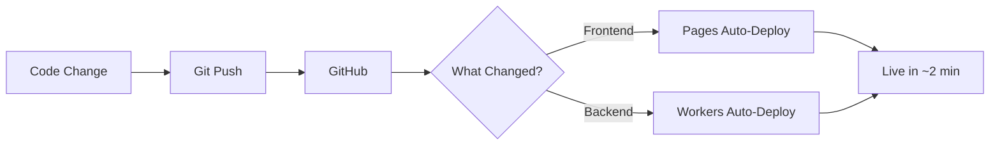

# 🚀 Panduan Deploy ke Cloudflare (Full GitHub Integration)

Panduan lengkap untuk deploy aplikasi Virtual Try-On ke Cloudflare **TANPA CLI** - semuanya pakai GitHub integration!

## 📋 Prerequisites

- Akun [Cloudflare](https://dash.cloudflare.com/) (gratis)
- Repository GitHub sudah di-push (✅ sudah)
- Gemini API Key dari [Google AI Studio](https://makersuite.google.com/app/apikey)

## 🎯 Arsitektur Deployment

```
Frontend (Cloudflare Pages)  ←→  Backend (Cloudflare Workers)
      ↓                                    ↓
  Static Website                    Google Gemini API
```

**✨ Keuntungan Full GitHub Integration:**
- ✅ Auto-deploy setiap push
- ✅ Tidak perlu CLI lokal
- ✅ Preview deployment untuk setiap PR
- ✅ Rollback mudah
- ✅ Logs terpusat di dashboard

---

## 📦 Part 1: Deploy Frontend ke Cloudflare Pages

### Step 1: Login ke Cloudflare Dashboard

1. Buka [Cloudflare Dashboard](https://dash.cloudflare.com/)
2. Login dengan akun Anda
3. Pilih **Workers & Pages** dari sidebar kiri

### Step 2: Create Pages Project

1. Klik tombol **Create application**
2. Pilih tab **Pages**
3. Klik **Connect to Git**

### Step 3: Connect GitHub Repository

1. Klik **Connect GitHub**
2. Authorize Cloudflare untuk akses GitHub Anda
3. Pilih repository: `danprat/virtual-tryon`
4. Klik **Begin setup**

### Step 4: Configure Build Settings

Isi konfigurasi berikut:

| Setting | Value |
|---------|-------|
| **Project name** | `virtual-tryon` (atau nama custom) |
| **Production branch** | `main` |
| **Framework preset** | `Vite` |
| **Build command** | `npm run build` |
| **Build output directory** | `dist` |
| **Root directory** | `/` (default) |

> ⚠️ **PENTING**: 
> - Gunakan `npm run build` bukan `bun run build` untuk kompatibilitas
> - Jangan tambahkan deploy command di Pages!
> - Pages otomatis deploy hasil build dari folder `dist`

### Step 5: Set Environment Variables

Klik **Add variable** dan tambahkan:

| Variable Name | Value |
|---------------|-------|
| `VITE_API_URL` | `https://virtual-tryon-api.YOUR_SUBDOMAIN.workers.dev` |

> ⚠️ **Catatan**: Ganti `YOUR_SUBDOMAIN` dengan nama Workers yang akan dibuat di Part 2. Bisa diupdate nanti.

### Step 6: Deploy Frontend

1. Klik **Save and Deploy**
2. Tunggu proses build (±2-3 menit)
3. Setelah selesai, Anda akan mendapat URL seperti: `https://virtual-tryon.pages.dev`

> 🚨 **COMMON ERROR**: Jika ada error "Missing entry-point to Worker script":
> - Buka **Settings** → **Build & deployments**
> - Pastikan **Deploy command** KOSONG (tidak ada isi)
> - Hanya isi **Build command** dan **Build output directory**
> - Pages otomatis deploy dari folder `dist`, tidak perlu wrangler!

### Step 7: Custom Domain (Opsional)

1. Pergi ke **Custom domains** tab
2. Klik **Set up a custom domain**
3. Masukkan domain Anda (contoh: `tryon.example.com`)
4. Ikuti instruksi DNS yang diberikan

---

## ⚡ Part 2: Deploy Backend ke Cloudflare Workers (via GitHub)

### Metode 1: Via Cloudflare Dashboard (Recommended - Paling Mudah!)

#### Step 1: Create Workers Project

1. Di **Cloudflare Dashboard**, masih di **Workers & Pages**
2. Klik **Create application** lagi
3. Kali ini pilih tab **Workers**
4. Klik **Create Worker**

#### Step 2: Name Your Worker

1. Beri nama: `virtual-tryon-api` (atau nama lain)
2. Klik **Deploy**
3. Worker template akan di-deploy dulu (kita akan override nanti)

#### Step 3: Connect to GitHub

1. Setelah worker created, pergi ke tab **Settings**
2. Scroll ke section **Build**
3. Klik **Connect to GitHub**
4. Pilih repository: `danprat/virtual-tryon`
5. Klik **Connect**

#### Step 4: Configure Build Settings

Set konfigurasi berikut:

| Setting | Value |
|---------|-------|
| **Production branch** | `main` |
| **Build command** | `cd backend && npm install && npm run build` |
| **Build watch paths** | `backend/**` |
| **Entrypoint** | `backend/src/index.ts` |

> 💡 Dengan `Build watch paths`, hanya perubahan di folder `backend/` yang trigger rebuild!

#### Step 5: Set Environment Variables & Secrets

1. Masih di **Settings**, pergi ke **Variables and Secrets**
2. Tab **Environment Variables** untuk public vars (jika ada)
3. Tab **Secrets** untuk sensitive data:
   - Klik **Add variable**
   - Name: `GEMINI_API_KEY`
   - Type: **Secret** (encrypted)
   - Value: Paste Gemini API key Anda
   - Klik **Add variable**

#### Step 6: Trigger Deployment

1. Pergi ke tab **Deployments**
2. Klik **Create deployment**
3. Atau push perubahan ke GitHub untuk auto-trigger
4. Tunggu build selesai (±1-2 menit)

Worker URL Anda: `https://virtual-tryon-api.YOUR_SUBDOMAIN.workers.dev`

### Metode 2: Via GitHub Actions (Alternative)

Jika lebih suka control penuh via GitHub Actions:

#### Step 1: Get Cloudflare API Token

1. Buka [Cloudflare Dashboard](https://dash.cloudflare.com/profile/api-tokens)
2. Klik **Create Token**
3. Gunakan template **Edit Cloudflare Workers**
4. Klik **Continue to summary** → **Create Token**
5. Copy token

#### Step 2: Add GitHub Secrets

1. Repository GitHub: `github.com/danprat/virtual-tryon`
2. **Settings** → **Secrets and variables** → **Actions**
3. **New repository secret**:
   - Name: `CLOUDFLARE_API_TOKEN`
   - Value: Paste token
4. **New repository secret** lagi:
   - Name: `CLOUDFLARE_ACCOUNT_ID`
   - Value: Copy dari Cloudflare Dashboard → Workers → Overview
5. **New repository secret**:
   - Name: `GEMINI_API_KEY`
   - Value: Your Gemini API key

#### Step 3: Update wrangler.toml

Tambahkan account ID di `backend/wrangler.toml`:

```toml
name = "virtual-tryon-api"
main = "src/index.ts"
compatibility_date = "2024-12-08"
account_id = "YOUR_ACCOUNT_ID"  # Ganti dengan account ID Anda

# Jika pakai custom domain
# routes = [
#   { pattern = "api.yourdomain.com/*", zone_name = "yourdomain.com" }
# ]
```

#### Step 4: Create GitHub Actions Workflow

File sudah ada di `.github/workflows/deploy.yml`, tapi update jadi:

```yaml
name: Deploy to Cloudflare

on:
  push:
    branches:
      - main
    paths:
      - 'backend/**'
      - '.github/workflows/deploy.yml'

jobs:
  deploy:
    runs-on: ubuntu-latest
    name: Deploy Workers
    steps:
      - uses: actions/checkout@v4
      
      - name: Setup Bun
        uses: oven-sh/setup-bun@v1
        with:
          bun-version: latest
      
      - name: Install dependencies
        working-directory: ./backend
        run: bun install
      
      - name: Deploy to Cloudflare Workers
        uses: cloudflare/wrangler-action@v3
        with:
          apiToken: ${{ secrets.CLOUDFLARE_API_TOKEN }}
          accountId: ${{ secrets.CLOUDFLARE_ACCOUNT_ID }}
          workingDirectory: ./backend
          secrets: |
            GEMINI_API_KEY
        env:
          GEMINI_API_KEY: ${{ secrets.GEMINI_API_KEY }}
```

#### Step 5: Push & Deploy

```bash
git add .
git commit -m "ci: update worker deployment with secrets"
git push
```

GitHub Actions akan otomatis deploy! 🎉

> 💡 **Note**: GitHub Actions akan pakai Bun karena sudah kita setup di workflow. Untuk local development tetap bisa pakai `bun run dev`.

---

## 🔄 Part 3: Update Frontend Environment Variable

Setelah Workers deployed, copy URL-nya dan update frontend:

### Step 1: Get Workers URL

Dari Cloudflare Dashboard → Workers → virtual-tryon-api:
```
https://virtual-tryon-api.YOUR_SUBDOMAIN.workers.dev
```

### Step 2: Update Pages Environment Variable

1. **Cloudflare Dashboard** → **Pages** → **virtual-tryon**
2. **Settings** → **Environment variables**
3. Edit `VITE_API_URL`:
   - Value: `https://virtual-tryon-api.YOUR_SUBDOMAIN.workers.dev`
4. Klik **Save**

### Step 3: Redeploy Frontend

1. Tab **Deployments**
2. Klik **︙** (three dots) pada latest deployment
3. Pilih **Retry deployment**
4. Atau push perubahan ke GitHub untuk auto-redeploy

---

## ✅ Verification & Testing

### Test Backend API

1. Buka browser atau terminal
2. Test health check:
   ```bash
   curl https://virtual-tryon-api.YOUR_SUBDOMAIN.workers.dev/
   ```
3. Expected response:
   ```json
   {"status":"ok","message":"TryOn API is running"}
   ```

### Test Frontend

1. Buka Pages URL: `https://virtual-tryon.pages.dev`
2. Browse produk
3. Klik "Try On" pada produk
4. Upload foto atau gunakan kamera
5. Lihat hasil virtual try-on

### View Logs

**Frontend (Pages):**
- Dashboard → Pages → virtual-tryon → **Deployments**
- Klik deployment → **View details** untuk build logs
- Tab **Functions** untuk runtime logs

**Backend (Workers):**
- Dashboard → Workers → virtual-tryon-api → **Logs**
- Real-time streaming
- Filter by status, method, search

---

## 🔧 Troubleshooting

---

## 🔧 Troubleshooting

### Issue 0: Deploy Error - "Missing entry-point to Worker script"

**Ini error yang muncul di Pages build log:**
```
✘ [ERROR] Missing entry-point to Worker script or to assets directory
```

**Penyebab:**
- Ada command `bunx wrangler deploy` yang seharusnya tidak ada di Pages
- Pages tidak perlu wrangler untuk deploy frontend

**Solusi:**
1. Pergi ke Pages → virtual-tryon → **Settings** → **Build & deployments**
2. Di **Build configurations**, pastikan **TIDAK ADA** pada:
   - Deploy command: (kosongkan atau hapus)
3. Yang diperlukan hanya:
   - Build command: `bun run build`
   - Build output directory: `dist`
4. Klik **Save**
5. **Retry deployment** dari tab Deployments

> 💡 Pages otomatis mengambil file dari folder `dist` setelah build. Tidak perlu deploy command tambahan!

### Issue 1: Build Failed - "Command not found: bun"

**Solusi:**
Gunakan npm sebagai gantinya:

**Pages:**
- Build command: `npm run build`
- Atau `npm install && npm run build`

**Workers (Dashboard method):**
- Build command: `cd backend && npm install && npm run build`

**Jika tetap ingin pakai Bun, tambahkan di root `package.json`:**
```json
{
  "packageManager": "bun@1.1.0"
}
```
Tapi lebih stabil pakai npm.

### Issue 2: CORS Error

Pastikan backend `src/index.ts` punya CORS:
```typescript
import { cors } from 'hono/cors';

app.use('/*', cors({
  origin: '*',
  allowMethods: ['GET', 'POST', 'OPTIONS'],
  allowHeaders: ['Content-Type'],
}));
```

### Issue 3: Environment Variable Tidak Terdeteksi

**Frontend:**
- Harus prefix `VITE_`
- Setelah update, **Retry deployment**

**Workers:**
- Use **Secrets** tab untuk sensitive data
- Redeploy setelah update secret

### Issue 4: Workers "Not Found" atau 404

Cek di Settings → Triggers:
- Pastikan ada route/trigger aktif
- URL harus match format: `*.workers.dev`

### Issue 5: Gemini API Error

**Re-set Secret:**
- Workers → Settings → Variables and Secrets
- Delete lalu add ulang `GEMINI_API_KEY`
- Atau via CLI:
  ```bash
  bun install -g wrangler
  wrangler login
  cd backend
  wrangler secret put GEMINI_API_KEY
  ```

---

## 🎨 Part 5: Advanced Configuration

---

## 🎨 Part 5: Advanced Configuration

### Custom Domain (Opsional)

**Frontend Pages:**
1. Pages → virtual-tryon → **Custom domains**
2. **Set up a custom domain**
3. Masukkan: `tryon.yourdomain.com`
4. Tambahkan CNAME di DNS provider:
   ```
   Type: CNAME
   Name: tryon
   Target: virtual-tryon.pages.dev
   ```
5. SSL otomatis aktif

**Backend Workers:**
1. Workers → virtual-tryon-api → **Triggers**
2. **Custom Domains** → **Add Custom Domain**
3. Masukkan: `api.yourdomain.com`
4. Ikuti instruksi DNS
5. Update `VITE_API_URL` di Pages

### Preview Deployments

**Otomatis untuk Pull Requests:**
- Setiap PR akan dapat preview URL unik
- Format: `https://abc123.virtual-tryon.pages.dev`
- Test changes sebelum merge!

### Rollback Deployment

**Pages:**
1. Tab **Deployments**
2. Pilih deployment lama yang stable
3. Klik **︙** → **Rollback to this deployment**

**Workers:**
1. Tab **Deployments**
2. Pilih version sebelumnya
3. Promote to production

### Analytics & Monitoring

**Enable Web Analytics (Pages):**
- Settings → **Analytics** → Enable
- Real-time visitors
- Page views, bandwidth

**Workers Analytics:**
- Metrics tab: requests, errors, latency
- Set up alerts untuk high error rate

---

## 📊 Part 6: Performance & Security

---

## 📊 Part 6: Performance & Security

### Caching Strategy

Backend `src/index.ts` bisa tambahkan cache headers:
```typescript
app.get('/api/products', (c) => {
  return c.json(products, 200, {
    'Cache-Control': 'public, max-age=3600', // Cache 1 hour
  });
});
```

### Rate Limiting (Opsional)

Simple rate limiting di Workers:
```typescript
const rateLimiter = new Map();

app.use('/api/*', async (c, next) => {
  const ip = c.req.header('CF-Connecting-IP') || 'unknown';
  const key = `${ip}:${Date.now() / 60000 | 0}`;
  
  const count = rateLimiter.get(key) || 0;
  if (count > 100) { // 100 requests per minute
    return c.json({ error: 'Too many requests' }, 429);
  }
  
  rateLimiter.set(key, count + 1);
  await next();
});
```

### Security Headers

Di Workers, tambahkan security headers:
```typescript
app.use('/*', async (c, next) => {
  await next();
  c.header('X-Content-Type-Options', 'nosniff');
  c.header('X-Frame-Options', 'DENY');
  c.header('X-XSS-Protection', '1; mode=block');
});
```

### Environment-specific Config

Di `wrangler.toml`:
```toml
# Production
[env.production]
name = "virtual-tryon-api"
vars = { ENVIRONMENT = "production" }

# Staging
[env.staging]
name = "virtual-tryon-api-staging"
vars = { ENVIRONMENT = "staging" }
```

Deploy ke staging:
```bash
wrangler deploy --env staging
```

---

## ✅ Deployment Checklist

---

## ✅ Deployment Checklist

**Persiapan:**
- [ ] Repository pushed ke GitHub ✅
- [ ] Akun Cloudflare created
- [ ] Gemini API Key ready

**Frontend (Pages):**
- [ ] Project created via GitHub integration
- [ ] Build settings configured (Bun)
- [ ] Environment variable `VITE_API_URL` set
- [ ] First deployment success
- [ ] Website accessible

**Backend (Workers):**
- [ ] Worker created (Dashboard atau GitHub Actions)
- [ ] GitHub connected (jika pakai Dashboard method)
- [ ] Secret `GEMINI_API_KEY` configured
- [ ] First deployment success
- [ ] API endpoint responding

**Integration:**
- [ ] Frontend env updated dengan Workers URL
- [ ] Frontend redeployed
- [ ] Test virtual try-on feature working
- [ ] Check logs untuk errors

**Optional:**
- [ ] Custom domain setup
- [ ] Analytics enabled
- [ ] GitHub Actions configured
- [ ] Staging environment created

---

## 🎯 Your Production URLs

Setelah deployment, catat URLs:

| Service | Default URL | Custom (Optional) |
|---------|-------------|-------------------|
| **Frontend** | `https://virtual-tryon.pages.dev` | `https://tryon.yourdomain.com` |
| **Backend** | `https://virtual-tryon-api.YOUR_SUBDOMAIN.workers.dev` | `https://api.yourdomain.com` |
| **GitHub** | `https://github.com/danprat/virtual-tryon` | - |

---

## 🚀 Continuous Deployment Flow



**Workflow:**
1. Develop locally (`bun run dev`)
2. Test perubahan
3. Commit: `git commit -m "feat: new feature"`
4. Push: `git push`
5. Cloudflare otomatis deploy (2-3 menit)
6. Check deployment di Dashboard
7. Test di production URL

---

## 📚 Resources & Help

---

## 📚 Resources & Help

**Official Docs:**
- [Cloudflare Pages](https://developers.cloudflare.com/pages/) - Frontend deployment
- [Cloudflare Workers](https://developers.cloudflare.com/workers/) - Backend/API
- [GitHub Integration](https://developers.cloudflare.com/pages/configuration/git-integration/) - Auto-deploy
- [Wrangler CLI](https://developers.cloudflare.com/workers/wrangler/) - CLI tool (optional)

**Community:**
- [Cloudflare Community](https://community.cloudflare.com/)
- [Discord: Cloudflare Developers](https://discord.gg/cloudflaredev)
- [Stack Overflow](https://stackoverflow.com/questions/tagged/cloudflare-workers)

**Tutorials:**
- [Deploy React to Pages](https://developers.cloudflare.com/pages/framework-guides/deploy-a-react-site/)
- [Build a REST API with Workers](https://developers.cloudflare.com/workers/tutorials/build-a-rest-api/)
- [Workers + Hono.js](https://hono.dev/getting-started/cloudflare-workers)

---

## 🎉 Kesimpulan

**Keuntungan Deploy via GitHub:**
- ✅ **Zero CLI** - Semua via Dashboard
- ✅ **Auto-deploy** - Push = Deploy otomatis
- ✅ **Preview URLs** - Setiap PR dapat preview
- ✅ **Rollback mudah** - Klik button aja
- ✅ **Free tier generous** - 100k requests/day
- ✅ **Global CDN** - Super cepat di seluruh dunia
- ✅ **Unlimited bandwidth** - Tidak ada batasan

**Next Steps:**
1. Test semua fitur di production
2. Setup custom domain (optional)
3. Enable analytics
4. Monitor logs & errors
5. Optimize performance
6. Share dengan dunia! 🌍

---

**Happy Deploying! 🚀**

Jika ada pertanyaan, cek logs di Dashboard atau tanya di Community Forum!
